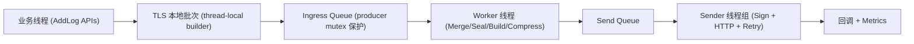

# ve-tls-c-sdk 架构评审文档（Aggressive Pipeline V2）

- 文档版本：v1.0（评审稿）
- 日期：2026-03-26
- 适用分支：`feat_improve_sdk_more`
- 评审目标：统一团队对当前 C SDK 架构现状、设计思路、优势与差距的认知，作为下一阶段优化决策依据。

---

## 1. 背景与评审范围

### 1.1 背景

`ve-tls-c-sdk` 面向 Linux/嵌入式/多端 Native 场景，需要在以下维度同时成立：

1. 高吞吐与低资源占用（CPU/RSS/拷贝次数）。
2. 强可控的背压、限流、重试、熔断能力。
3. 稳定的 C API 与多语言绑定友好性（JNI/FFI）。
4. 配置/凭证可热更新，发送线程不被配置锁阻塞。

本轮（Aggressive Pipeline V2）重点方向是将链路更明确地分层：`Ingress -> Pack/Compress -> Send`，并引入对象池、运行时快照、模板日志 API。

### 1.2 本文范围

1. 当前主干代码中已经落地的架构与实现。
2. 与目标架构的对齐程度和差距。
3. 对内部评审有决策价值的优劣势与后续建议。

不包含：

1. `persistent` 分支的落盘恢复语义细节。
2. 跨进程共享内存/多进程队列方案。
3. 服务端协议演进（仅讨论 SDK 侧）。

---

## 2. 总体框架与分层

### 2.1 模块分层

1. `core/`：Producer 核心逻辑（队列、聚合、压缩、重试、签名、发送、错误/指标模型）。
2. `adapters/`：平台与 HTTP 适配（pthread、posix、curl/noop）。
3. `tools/`：基准与演示（`ve_tls_bench`、`ve_tls_perf_sls`、`ve_tls_benchmark_sls` 等）。
4. `tests/`：单测与回归用例。

### 2.2 运行时拓扑（当前实现）

可选全局模式：

1. `use_global_env=1` 时，多个 producer 可共享全局发送调度线程（`ve_tls_env`）。

---

## 3. 设计思路（Why）

### 3.1 热路径分层，降低耦合

核心思路是把“写入、组包压缩、签名发送”拆成职责单一的阶段，避免业务写入线程直接参与网络发送与复杂控制逻辑。

### 3.2 用 hashKey 保证局部有序，同时释放并行性

1. 同一 `hashKey` 进入同一 key queue，维持顺序发送。
2. 不同 key 并行消费，提高吞吐并降低热点 key 对全局的连带影响。

### 3.3 配置与凭证“快照化”

1. 发送线程通过原子读取不可变快照（`runtime_snapshot`）。
2. 更新端点/凭证时生成新快照并原子切换，避免发送线程与主锁长期竞争。

### 3.4 以可观测性驱动稳定性

通过 metrics sink、错误结构（HTTP/transport/retryable/request_id）与回调体系，使“性能问题/失败路径”可定位、可量化。

---

## 4. 详细设计（How）

### 4.1 核心数据结构

1. `ve_tls_producer`
   - 持有配置副本、线程/锁、多级队列、指标计数、版本号、快照指针。
2. `ve_tls_runtime_snapshot`
   - 包含 endpoint/region/topic/compress_type/AKSK/token/timeout 等发送只读字段。
   - 通过 `_Atomic(refcnt)` 做 acquire/release 生命周期管理。
3. `ve_tls_log_group_builder`
   - 负责 protobuf 日志组增量构建与统计（count/earliest/latest/id range）。
4. `ve_tls_send_task`
   - 承载发送所需 payload 与元信息（body/precompressed/hash_key/log_count/time range）。
5. `ve_tls_key_queue`
   - 每 key 独立任务队列，附带 key 级限流、熔断、延迟重入状态。
6. `ve_tls_obj_pool`
   - 通用无锁对象池结构（当前已初始化，集成使用仍有差距，见第 7 节）。

### 4.2 写入路径（KV 日志）

1. `add_log_kv*` 先做输入校验与 time/time_ns 补齐。
2. 默认优先走 TLS 本地 batch（无 hashKey 且非 ordered_send 的场景）。
3. 达到阈值或 flush 时，本地 batch 入 `ingress_queue`。
4. worker 合并 ingress 到 builder，按条数/字节/超时 seal 成 send task。
5. send task 进入 send queue，sender 负责签名/HTTP/retry。

### 4.3 Raw 路径

`add_log_raw*` 直接入 `queue`，worker 再转 send task；适合已编码日志场景。

### 4.4 线程与并发模型

1. `producer->mutex`
   - 保护主状态：入队、builder、sealed 链表、close/flush 协调。
2. `send_queue` 自带独立 mutex/cond
   - 减少发送队列与主状态的锁冲突。
3. 原子变量
   - 计数器、版本号、snapshot 指针、fast inflight、env 状态等。
4. thread-local cache
   - 发送线程缓存 send config 与 static creds，减少重复拷贝与解析。

### 4.5 配置/凭证热更新流程

1. `ve_tls_producer_update_endpoint`
   - 更新 endpoint/region/topic，递增 `send_cfg_version`，刷新 snapshot。
2. `ve_tls_producer_update_static_credentials`
   - 更新 AK/SK/token，递增 `static_cred_version`，刷新 snapshot。
3. sender 侧
   - 检测版本变化后刷新线程本地 cache；发送时按 snapshot 的一致视图构造请求。

### 4.6 背压与失败策略

1. 内存背压：`max_buffer_bytes + buffer_full_policy(DROP/BLOCK)`。
2. 发送队列背压：`send_queue_full_policy(BLOCK/DROP/DROP_SAMPLED)`。
3. 全局限流/熔断：`rate_limit_*` + `breaker_*`。
4. key 级限流/熔断：`key_rate_limit_*` + `key_breaker_*`。
5. 重试：基于 `retry_policy` 与 `retryable` 判定。

### 4.7 关闭语义

1. `close(timeout)`
   - 停止接收新写入，触发 flush，等待全链路 drain，超时返回 `VE_TLS_TIMEOUT`。
2. `destroy`
   - 资源回收与线程退出；`use_global_env` 模式先注销 env 再释放本地资源。

### 4.8 高性能模板日志 API

1. `ve_tls_template_create`
   - 固定字段 key 预建模板。
2. `ve_tls_template_add_values`
   - 高频仅传 values，减少重复 key 处理开销。
3. `ve_tls_template_destroy`
   - 模板生命周期回收。

---

## 5. 功能优势总结

### 5.1 工程与架构优势

1. C11 + adapter 分层，平台迁移成本低。
2. API 覆盖 raw/kv/with_len/template，满足从通用到极致性能的不同模式。
3. 支持全局 Env 共享发送线程，适合多 producer 场景。

### 5.2 可靠性优势

1. 背压、重试、限流、熔断机制完整，具备生产治理能力。
2. 错误模型结构化（HTTP、transport、retryable、request_id、error body 字段）。
3. close/destroy 语义区分清晰，可做优雅停机。

### 5.3 可观测性优势

1. 指标覆盖 enqueue/drop/request/retry/latency buckets/bytes sent。
2. callback v2 提供更完整错误上下文。
3. HTTP debug 可检查关键 header 与失败上下文。

---

## 6. 性能现状（截至本次评审）

### 6.1 数据来源与口径

来源：`docs/result/v1_mode_diff.md`。  
口径：

1. `perf_sls`：`mock + sls700 + target_lps(50k~250k) + writers(1/4/16)`。
2. `benchmark_sls`：`SLS_BENCH_PROFILE=sls700` 快路径口径。

### 6.2 `perf_sls` 分支对比结论（15 组样本）

共性：

1. 两分支均 `close_rc=0`、`dropped=0`，稳定性一致。
2. 两分支 `achieved_lps` 与 `target_lps` 基本重合（均值绝对误差约 `3.06 lps`，可视为吞吐等价）。

资源对比（按 writers 分组平均）：

| writers | feat_improve_sdk avg_cpu_pct_total | feat_improve_sdk_more avg_cpu_pct_total | 变化 | feat_improve_sdk avg_rss_mb | feat_improve_sdk_more avg_rss_mb | 变化 |
|---:|---:|---:|---:|---:|---:|---:|
| 1 | 1.284 | 1.354 | +5.5% | 11.78 | 16.47 | +39.8% |
| 4 | 2.852 | 2.948 | +3.4% | 34.69 | 42.07 | +21.3% |
| 16 | 6.332 | 6.478 | +2.3% | 107.00 | 145.12 | +35.6% |

结论：在 `perf_sls` 口径下，`feat_improve_sdk_more` 吞吐未明显提升，但 CPU 和 RSS 有小幅到明显上升，RSS 上升更突出。

### 6.3 `benchmark_sls` 快路径对比

| 分支 | total_us | avg_us_per_log | cpu_pct_total | rss_mb |
|---|---:|---:|---:|---:|
| feat_improve_sdk | 7696662 | 0.64 | 1.23 | 21.18 |
| feat_improve_sdk_more | 7503051 | 0.63 | 1.19 | 25.04 |

结论：

1. `avg_us_per_log` 从 `0.64 -> 0.63`（约 +1.6% 改善），`total_us` 约 +2.5% 改善。
2. CPU 略降（`1.23 -> 1.19`），但 RSS 上升约 18.2%。

### 6.4 评审解读（建议口径）

1. 当前分支收益更偏“快路径微优化”，而非吞吐上限突破。
2. `perf_sls` 与 `benchmark_sls` 都指向同一事实：性能收益有限，但内存占用上升。
3. 后续评审应把“吞吐等价下的内存回收与池化实效”作为 P0，而不是继续追逐单点 `us_per_log`。

---

## 7. 与目标方案的对齐度与差距

### 7.1 已对齐

1. 三段式主链路雏形已成立（Ingress/Worker/Send）。
2. 配置与静态凭证快照 + 版本号机制已落地并参与发送。
3. 模板日志 API 已落地并有测试覆盖。
4. key 级有序发送与治理能力（限流/熔断/延迟队列）已具备。

### 7.2 未完全对齐（评审重点）

1. `Pack/Compress` 仍为单 worker，尚非“集中线程池”。
2. 对象池未在 send/header/compress 热路径全面复用（当前主要是 init/destroy 与单测层验证）。
3. “全链路池化 + 明显吞吐收益”尚未被性能数据证明。
4. 基准口径仍偏单点，需要补强端到端/尾延迟/长稳压测。

---

## 8. 评审建议与后续任务

### 8.1 建议本次评审决议

1. 认可当前版本作为“V2 架构基础版”（方向正确，核心机制已具备）。
2. 不将本版本定义为“最终性能版”，需继续完成并行化与池化闭环后再做性能结论。

### 8.2 建议后续任务（按优先级）

1. P0：将 Pack/Compress 从单 worker 升级为可配置 worker 池。
2. P0：把对象池 `get/put` 接入 send task/header/compress 实际热路径，并补指标（hit/miss/inuse）。
3. P0：针对 `feat_improve_sdk_more` 的 RSS 回归做专项治理（定位 TLS batch、builder 保留与队列峰值占用）。
4. P1：完善 benchmark 口径
   - 增加端到端（curl 模式）与 p95/p99；
   - 固化 `perf_sls` 对标矩阵（吞吐/丢弃/CPU/RSS）。
5. P1：补齐“配置热更新 + 压测并发”组合场景回归。
6. P2：输出版本化性能基线与回归门禁阈值。

---

## 9. 评审清单（会前可直接过）

1. 架构清晰度：是否认同当前分层职责边界？
2. 一致性：快照更新语义与 sender 读取模型是否满足并发一致性预期？
3. 性能路径：是否接受“先完成池化/并行化，再给最终性能结论”的节奏？
4. 风险控制：close/destroy 行为、背压策略、失败回调是否覆盖业务诉求？
5. 落地计划：P0/P1 任务是否需要调整优先级与 owner。

---

## 10. 关键代码与文档索引

1. API：`core/include/ve_tls_producer.h`
2. 主流程：`core/src/ve_tls_producer.c`
3. 队列与 key 调度：`core/src/producer/ve_tls_producer_queue.c`
4. builder 与编码：`core/src/producer/ve_tls_producer_builder.c`
5. 发送与重试：`core/src/producer/ve_tls_producer_sender.c`
6. 快照：`core/src/producer/ve_tls_snapshot.{h,c}`
7. 对象池：`core/src/producer/ve_tls_pool.{h,c}`
8. 全局 Env：`core/src/producer/ve_tls_env.c`
9. SLS 对标工具：`tools/perf_sls.c`、`tools/performance_sls_run.sh`
10. 基准工具：`tools/benchmark_sls.c`
